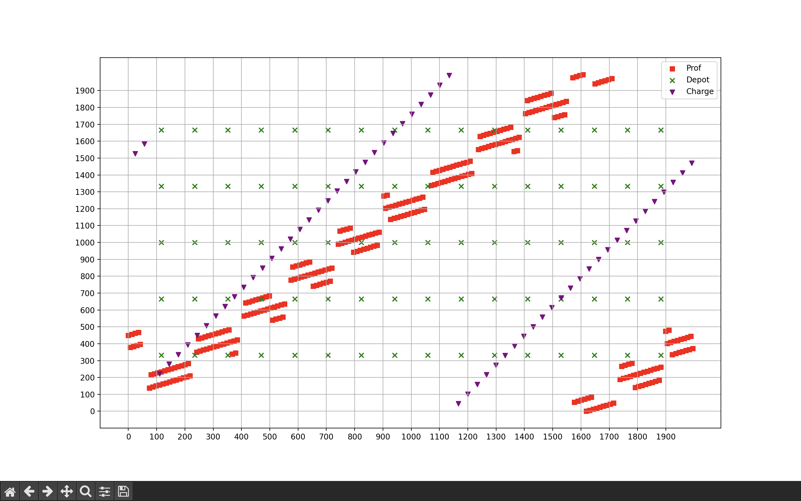

# 10 Days Over Kanpur Documentation 

## Encryption Process

The encryption process relies on the unique generation of the two primes **p** and **q**.  
They are each constructed by adding two numbers:

$p = a^4 + \text{secret}_1, \quad q = b^4 + \text{secret}_2$

where **a** and **b** are 512-bit integers, and `secret1`, `secret2` are 16-bit integers.

Since the 16-bit integers are very small compared to the fourth powers, the primes are very close to perfect fourth
powers. Consequently, the modulus

$n = p \cdot q$

is also quite close to a fourth power, specifically that of **ab**.

---

### Initial Approximation

We define:

$k = \sqrt[4]{n}$

This **k** is only an estimate and may not equal **ab**, but the actual value will always satisfy:

$ab \geq k$

---

### Polynomial Relation

Rewriting:

$n = (a^4 + \text{secret}_1)(b^4 + \text{secret}_2)$

in terms of **a** only (by eliminating **b**) produces a degree-8 polynomial in **a**.

SageMath provides a convenient `.roots()` method to solve for integer roots.  
We are only interested in **positive roots**.

---

### Root Verification

For each positive solution **a**:

1. Compute a candidate  
   $p = a^4 + \text{secret}_1$
2. Check divisibility: if \(p \mid n\), then stop and compute  
   $q = \frac{n}{p}$
3. If not, increment $k \leftarrow k+1$ and repeat.

This process repeats at most **1000 times**, which is sufficient to cover all cases.

---

### Private Key Recovery

Once **p** and **q** are found:

1. Compute Euler’s totient:
   $\varphi(n) = (p-1)(q-1)$
2. Find **d** such that:  
   $ed \equiv 1 \pmod{\varphi(n)}$
   SageMath provides `inverse_mod()` to compute **d**.

---

### Message Decryption

Finally, recover the message:

$m \equiv c^d \pmod{n}$

Convert **m** to binary, then to a string, yielding the **final password**.

## Algorithm

### The Approach

1. We first drew the given grid to get a rough idea about how things are arranged. We did this in python using
   matplotlib. Here is the mapping -

   
2. The drones were distributed more or less randomly around the grid.
3. Now that we have a rough idea on how things look like, we think of a solution.
4. From the scoring it is clear that we need to prioritize keeping the drones charged at all times since the penalty of
   a drone dying is quite high.
5. To achieve this, we made our solution revolve around the charging stations ie. we make a graph with the charging
   stations as the nodes and edge weights corresponding to the manhattan distance between the stations. We now
   precompute the shortest path between any two charging stations while ensuring that no edge of weight greater than a
   certain threshold (1480) is used.
5. The main idea now is that any general delivery looks
   like $D \rightarrow C_1 \rightarrow\dots\rightarrow C_k \rightarrow P$. Here $D$ stands for depot, $C_i$ for charging
   stations and $P$ for professor. There we precompute the feasible charger links between depots and professors using
   the charger-graph to guarantee rechargeable routes between pickup (at $D$) and dropoff (at $P$).
6. We then sort all the deliveries based on their appeared time and assign tasks to drones in a queue-driven manner.
   This allows us to construct a per-drone path which has the above-mentioned general form.

---

### Input / Output

- `final_solution.cpp` reads from the file `input.txt` which follows the input format mentioned in the problem statement.
- It prints to `output.txt`, again, according to the format mentioned in the statement.

---

### Important files

- `final_solution.cpp`: Main implementation/solution.
- `input.txt`/`output.txt`: The input and output files for `final_solution.cpp`.
- `map.png`: Visualisation of the input file.
- `documentation.md`: Documentation explaining the approach/algorithm
- `10Days.pptx`: Presentation of the algorithm. 
- `validator.cpp`: Validator code which validates the output provided by `final_solution.cpp`.
- `passwords.txt`: Stores the decrypted list of passwords. 

---

### Main functions in final_solution.cpp

- `input()` — Parses input and initializes data structures.
- `dist(x1,y1,x2,y2)` — Computes Manhattan distance between $(x1, y1)$ and $(x2, y2)$.
- `nearestCharger(r,c)` — Brute-force nearest charging station for $(r, c)$.
- `chargingGraph()` — Constructs all pairs shortest path between charging stations (using Floyd Warshall).
- `DCPpreProcess()` — Precomputes shortest routes from any depot to any professor using charger nodes
- `orderPreProcess()` — Sorts and orders the deliveries according to their appear times.
- `droneMove()` & `droneMove2()` — Per-drone movement logic that drives it from pickup to dropoff location.
- `turn()` — Invoked every turn to execute commands for all drones based on current state.

---
### Data structures:

- `vector<pair<int,int>> chargeLoc`: List of charger locations.
- `vvll distCharge`: $P \times P$ grid containing all pairs shortest paths between charging stations.
- `vvll pathCharge_next_node`: $P \times P$ matrix storing the index of the next charging station to recover the
  shortest charger-to-charger path.
- `vvll pathDepotToProf`: Shortest path between every (depot, professor) pair.
- `queue<ll> orderQueue`: Ordering of the deliveries to be made.

--- 
### Pre Processing Details:

- **Charger graph (chargingGraph())** -  this function precomputes the shortest paths between all pairs of charging stations using Floyd-Warshall algorithm.
It also populates the distCharge and pathCharge_next_node matrices which are defined as follow:
1) distCharge[i][j] : The shortest distance between charging station i and j
2) pathCharge_next_node[i][j] : The next charging station to visit after i in order to reach j in the shortest path

- **Build feasible Depot → Prof routes (DCPpreProcess())** - For every depot d and professor c : 
1) Compute nearby chargers for depot and professor (distance threshold `Bmax/2-10`) and enumerate candidate pairs. For each depot-charger j and prof-charger i pair pick the most efficient path. `
2) Basically the DCP stands for Depot to Charger to Professor so this is what the function does. After this store the two chosen charger indices for later path assembly. 

- **Order Selection (orderPreProcess())** - 
1) Rank orders by a heuristic value (deadline - appear_turn) * value (orders with higher value are favored).
2) Filter to orders where a nearby charger exists for both depot and prof (feasible by earlier precomputation).
3) Also if a order is not possible to process due to insufficient inventory then we perform a stay operation instead of pickup but we reduce the battery still by 5 so in our output.txt even if there are invalid commands related to pickup or dropoff then also the solution gurantees that the drone is not lost.

---
### Per Drone planning and runtime behaviour

- **Initial Charging Priority** - our solution gurantees that all drones charge to full battery at the start (or ensures drones are safely charged before assignments). This prevents drone losses.

- **Assignment** - When a drone is ready to take a job, it pops an order from orderQueue and a path is assembled as:
1) current charger → (intermediate chargers along get_charger_path) → depot charger → depot → charger path to professor → professor → nearest charger
2) The waypoint list is converted to concrete grid coordinates (charger/depot/prof coordinates) and is stored in dronePath[i].

3) Finally at every turn the drone either charges (if at a charger and not full), moves towards the next waypoint, performs a PICKUP depot (consuming 5 battery), or DROPOFF at prof (consuming 5 battery). 

- **Battery Safety** - If battery is low, the drone is routed to the nearest charger and it charges the drone until it reaches maximum battery.

---
### Key Constants and Heuristics Used 

- `Bmax-20` and `Bmax/2-10` which were the distance thresholds used in charger graph initialization and in feasibility filtering. These were the constants chosen to limit search and guarantee recharge paths.
- Orders sorted by **(deadline - appear) * value** to prioritize high-value & flexible jobs.

---
### Complexity Summary

- **Charger Graph** — $O(P^3)$ (Floyd–Warshall)
- **Depot→Prof preprocessing** - $O(M * C * P^2)$ in the worst-case
- **Order Sorting** - $O(N*log(N))$
- **Simulation loop** -  $O(T * D)$ 

---
### Limitations and Improvements
- **Inventory is not actively decremented** - this was explained earlier as well. It assumes inventories are sufficient for
queued orders. However if it tries to pickup an order whose inventory is not sufficient then also it tries to pickup the order. According to the PS it would be an invalid move and instead of pickup it would execute `STAY`. However according to our strategy we still deduct 5 battery points and ensures that the drone is not discharged.

- **The system is designed for safety-first** - it avoids lost drones rather than maximal throughput or approvably optimal schedule.

- **Bruteforcing the pre-processing part** - some functions written for pre computation are brute forced and they could have been more optimised. 